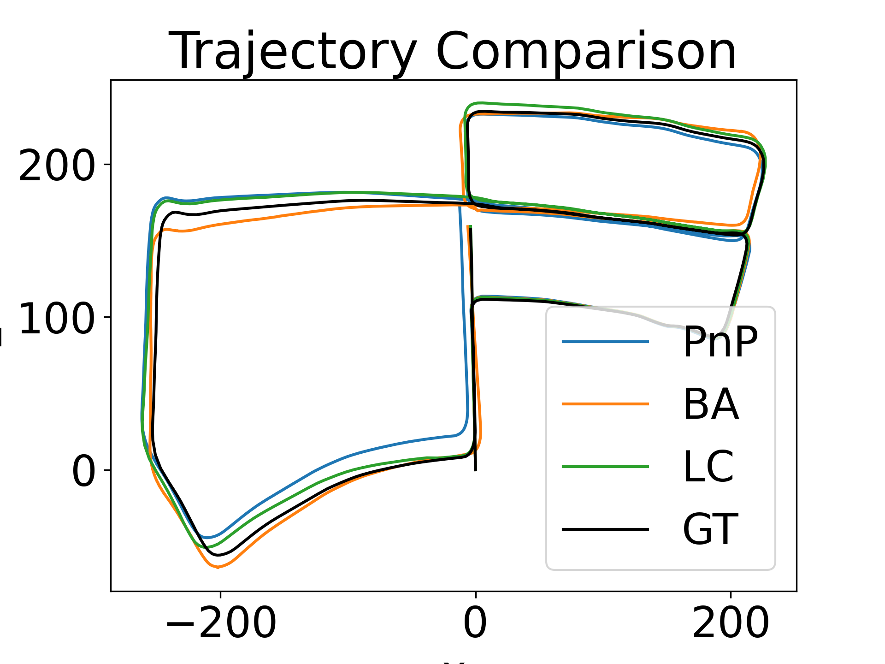
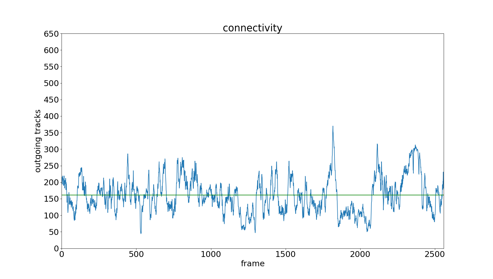
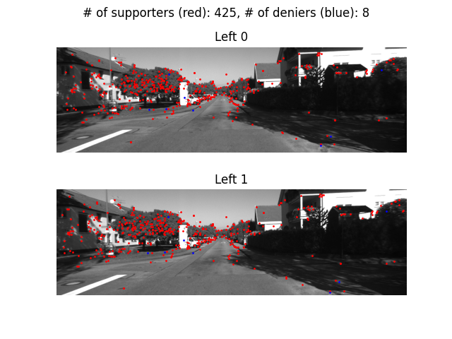
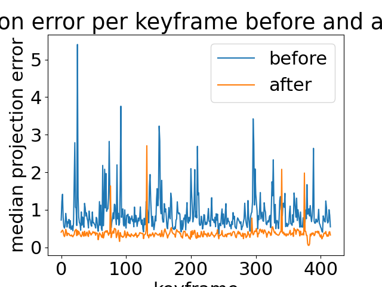
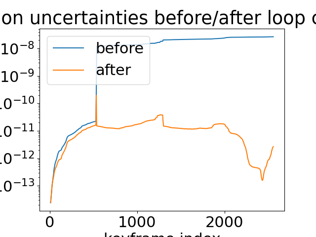

# Stereo Visual SLAM

A from-scratch implementation of a stereo visual SLAM system that recovers a vehicle's
trajectory and a sparse map of the environment from a sequence of stereo image pairs.
The pipeline is evaluated on sequence 05 of the [KITTI](https://www.cvlibs.net/datasets/kitti/)
odometry dataset (~2,560 stereo frames), using the provided ground-truth poses for
quantitative validation.

The system is built in three stages that progressively refine the trajectory:

1. **Frame-to-frame PnP localization** — produces an initial, drift-prone trajectory.
2. **Local bundle adjustment** — re-optimizes camera poses and landmarks over short
   keyframe windows.
3. **Pose-graph optimization with loop closure** — corrects long-range drift by
   detecting revisits and closing the resulting loops.



The figure above shows the recovered trajectory (top-down view) for each stage compared
to ground truth. PnP drifts noticeably; BA tightens the local geometry; loop closure
brings the global trajectory back onto the ground-truth path.

---

## 1. Feature tracking and the track database

For every stereo pair the system detects AKAZE features in all four images
(left/right of the current pair and left/right of the next pair), matches them with a
brute-force Hamming matcher, and applies two outlier rejection steps:

- A **Lowe ratio test** on every match (ratio = 0.5).
- A **stereo geometric rejection**: matches whose y-coordinates differ by more than 2
  pixels in a rectified stereo pair are discarded, since for a calibrated rectified rig
  corresponding points must lie on the same scanline.

A surviving match must be consistent across all four images — left₀↔right₀,
left₁↔right₁, and left₀↔left₁ — to be used. Each consistent inter-frame match either
extends an existing track or starts a new one. Tracks are stored in a `TrackDB` keyed
by frame and track id, providing fast access to the locations of a feature in every
frame it appears in. This database is the backbone of every later stage (PnP, BA,
loop closure).



The connectivity plot above shows, for each frame, how many tracks continue into the
next frame. The mean (~160) is healthy: enough overlap to estimate motion robustly
across the entire sequence.

---

## 2. PnP-based frame-to-frame localization

Given the track database, the relative pose between two consecutive frames is
estimated using **PnP inside a RANSAC loop**:

1. The 3D position of each tracked feature is obtained by **triangulating** its
   left/right observations in the previous stereo pair (using the calibration matrices
   read from `calib.txt`).
2. Four matches are sampled at random and `cv2.solvePnP` (AP3P) recovers a candidate
   `[R | t]` mapping the previous left camera to the next left camera.
3. Each candidate is scored by the number of **supporters** — tracks whose 3D point
   re-projects within a small pixel threshold on the next left image. The candidate
   with the most supporters is kept.
4. RANSAC iteration count is updated adaptively from the current inlier ratio.
5. The final pose is refined by re-running PnP on all supporters.



Most matches end up as supporters of the recovered pose, confirming that the geometric
estimate is consistent with the data. Composing these relative poses gives a global
trajectory, but small errors accumulate frame-to-frame and the path drifts over the
sequence.

---

## 3. Local bundle adjustment

To reduce drift we re-optimize geometry over short windows of frames using
[GTSAM](https://gtsam.org/). The sequence is split into overlapping **bundles** whose
length is chosen adaptively from the median track length starting at each keyframe
(clipped to 5–20 frames). Each bundle defines a non-linear factor graph with:

- a `Pose3` variable per camera in the window,
- a `Point3` variable per landmark visible in at least 3 frames of the window,
- a `GenericStereoFactor3D` for every stereo observation (combining the left and right
  pixel measurements), and
- a `PriorFactorPose3` anchoring the first camera.

Each bundle is solved with Levenberg–Marquardt. After all bundles are optimized
locally, their results are stitched together by chaining the optimized end-pose of one
bundle to the start of the next, giving a globally consistent set of camera poses and
landmarks.



The drop in median reprojection error from ~1 px to ~0.3 px confirms that bundle
adjustment fits the geometry far better than chained PnP.


Plotting the optimized trajectory together with the optimized landmarks (top-down)
shows landmarks clustering along the actual structures the vehicle drives past, with
the trajectory tracking the ground truth.

---

## 4. Pose graph and loop closure

Long-distance drift remains, because each bundle is only optimized locally. To correct
it the system builds a **pose graph** over the keyframes:

- **Nodes**: the keyframe poses produced by bundle adjustment.
- **Sequential edges**: between consecutive keyframes, with relative pose and
  conditional covariance read from the marginals of the corresponding bundle.

For every new keyframe the system searches earlier keyframes for **loop-closure
candidates**:

1. Candidates are scored by the Mahalanobis distance between the current keyframe's
   estimated pose and earlier keyframes (covariance is summed along the shortest path
   in a parallel covariance graph maintained with Dijkstra).
2. The top candidates are verified by **consensus matching** — running the PnP+RANSAC
   localizer between the two keyframes and checking the inlier percentage.
3. A successful candidate is refined with a small bundle on the inlier matches, and
   the resulting relative pose + covariance is added to the pose graph as a loop
   closure edge.

After every accepted loop closure the pose graph is re-optimized with
Levenberg–Marquardt, which redistributes accumulated drift across all keyframes in the
loop.



The uncertainty per keyframe — measured as the square root of the determinant of the
conditional covariance to the first keyframe — drops by **several orders of magnitude**
once loop closures are added, in addition to the visible improvement in trajectory
accuracy seen in the top figure.

---

## Quantitative results

The pipeline is evaluated against the KITTI ground truth using both **absolute**
(per-frame translation/orientation error vs. GT) and **relative** errors (drift over
sub-sequences of 100 / 300 / 800 frames). Each successive stage reduces both: PnP →
BA → LC. All evaluation plots are produced by `project/performance_analysis.py` and
saved to `project/results/`.

---

## Repository layout

```
project/
├── run/                         # entry points (build track DB, run BA, run BA + LC)
├── track_db_dir/                # Track and TrackDB classes (feature tracks)
├── consensus_matching_dir/      # feature tracking, triangulation, PnP-RANSAC localizer
├── bundle_adjustment_dir/       # local + global bundle adjustment with GTSAM
├── loop_closure_dir/            # closure graph, loop-closure bundle, pose graph
├── performance_analysis.py      # evaluation against KITTI ground truth
├── shared_utils.py              # shared helpers (camera I/O, geometry, plotting)
└── results/                     # generated plots
```

## Running

```bash
# build the track database (one-time, ~minutes)
python project/run/create_track_db.py

# run bundle adjustment only
python project/run/run_bundle_adjustment.py

# run the full pipeline (BA + loop closure)
python project/run/run_bundle_adjustment_with_loop_closure.py

# regenerate every evaluation plot
python project/performance_analysis.py
```

The KITTI sequence 05 images and `calib.txt` are expected under `dataset/sequences/05/`.
